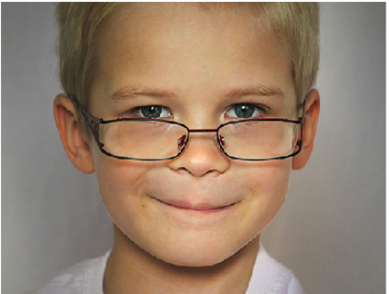
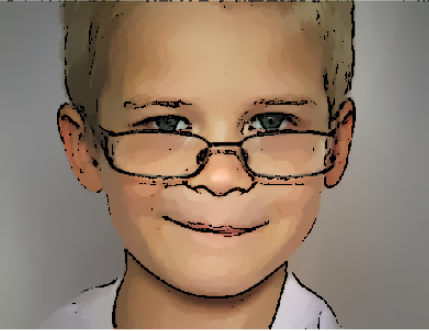
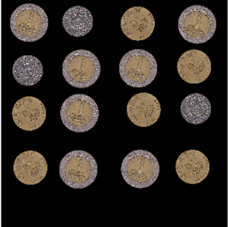
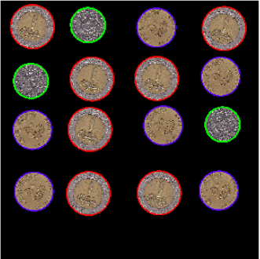

# Computer-vision-Course-assignment
This repo is the combination of all assignments in the Computer vision course CC490N.

# Assignment one ( Image Cartoonifier)
we want to make the real-world images look like they are genuinely from
a cartoon. The basic idea is to fill the flat parts with some color and then draw thick lines on
the strong edges. In other words, the flat areas should become much more flat and the edges
should become much more distinct. We will detect edges and smooth the flat areas, then draw
enhanced edges back on top to produce a cartoon or comic book effect.

## The original Image:

## Result Image:

------------------------------------------------------------------
# Assignment Two (Coin Detecion)
The objective of this problem set is the detection of circular coins in an image using Hough
Transform. This task can be subdivided into the following procedures:
1. The image is smoothed in order to reduce the amount of noise.
2. An edge detection procedure is implemented.
3. A circular Hough transform is used for circle detection.
4. Coins classification based on the radius of the detected circle.

## The original Image:

## Result Image:

--------------------------------------------------------------------
