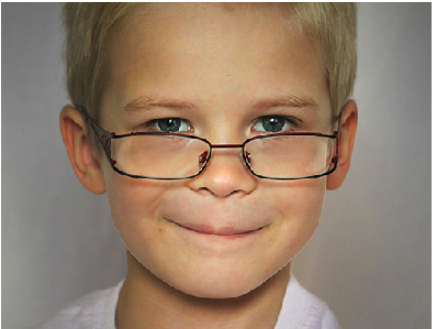
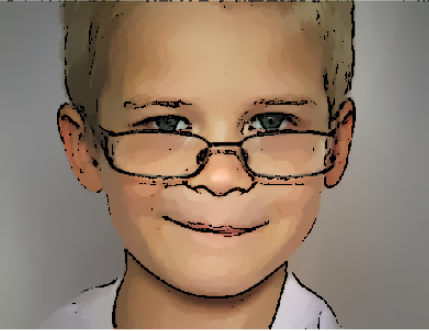

# Computer-vision-Course-assignments
This repo is the combination of all assignments in the Computer vision course CC490N.

# Assignment one ( Image Cartoonifier)
we want to make the real-world images look like they are genuinely from
a cartoon. The basic idea is to fill the flat parts with some color and then draw thick lines on
the strong edges. In other words, the flat areas should become much more flat and the edges
should become much more distinct. We will detect edges and smooth the flat areas, then draw
enhanced edges back on top to produce a cartoon or comic book effect.

## The original Image:

## Result Image:

------------------------------------------------------------------
